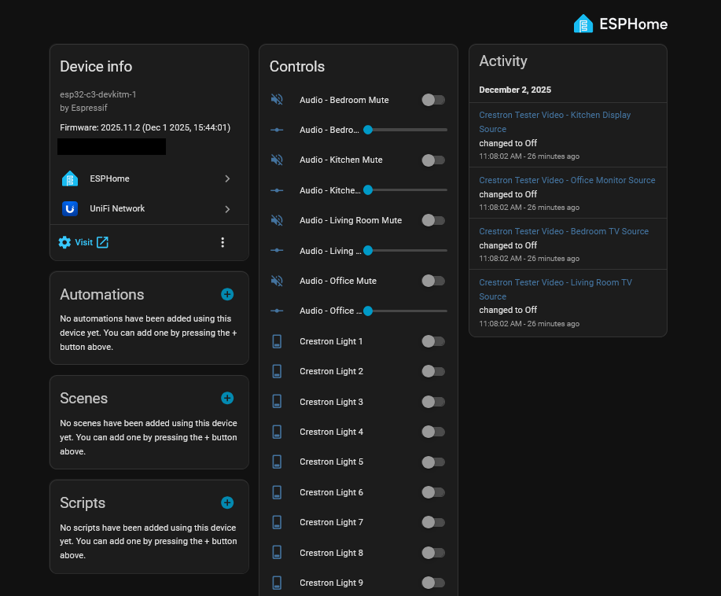
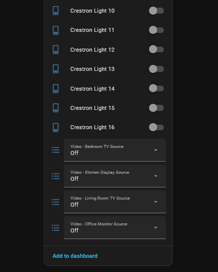
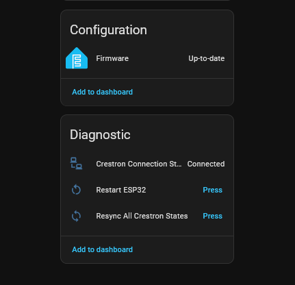
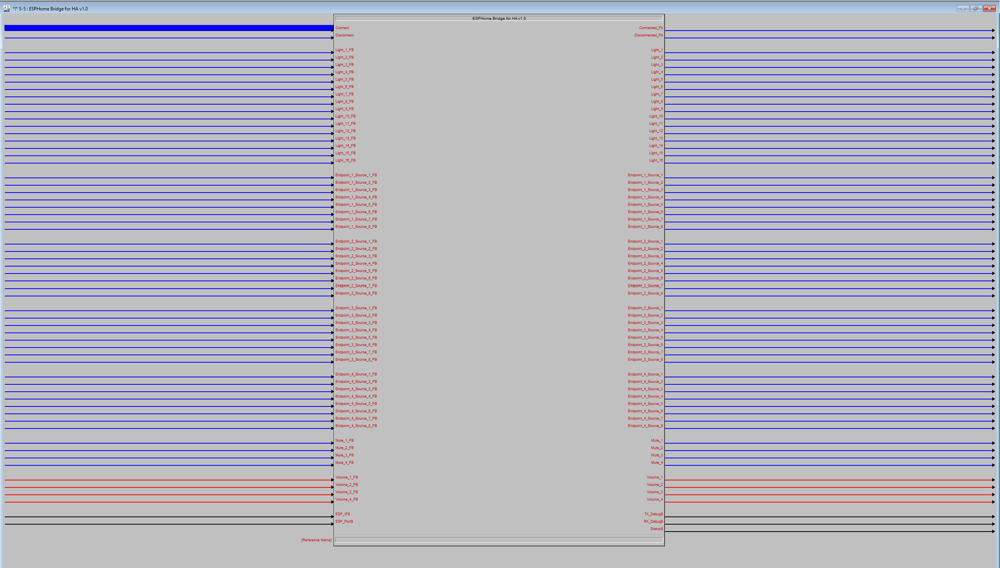

# Crestron ESPHome Bridge

Bidirectional TCP bridge between Crestron control processors and Home Assistant via ESPHome.

See [Installation Guide](#installation-steps) below for complete setup instructions.

## Features

- **16 Bidirectional Light Controls** - Full state synchronization between Crestron and Home Assistant
- **4 Video Endpoints** - 8-source video routing per endpoint
- **4 Audio Zones** - Volume control (0-100%) with mute functionality
- **Auto-Reconnection** - Automatic recovery from connection loss
- **Real-time Sync** - Instant feedback from Crestron Processor
- **Keepalive Protocol** - Maintains persistent connection with heartbeat

## Architecture

```
┌─────────────────┐         ┌──────────────┐         ┌─────────────────┐
│  Home Assistant │◄───────►│    ESP32     │◄───────►│    Crestron     │
│   (ESPHome)     │  WiFi   │    Bridge    │  TCP    │    Processor    │
└─────────────────┘         └──────────────┘  :50001 └─────────────────┘
```

## Hardware Requirements

- **ESP32 Board** (ESP32-C3-DevKitM-1 recommended, also supports S3 and original ESP32)
- **Crestron Control Processor** with TCP/IP Client support
- **Network:** Both devices must be on same network with port 50001 accessible
- **Home Assistant** with ESPHome add-on or ESPHome standalone installation

---

# Installation Guide

## Prerequisites

- **ESP32 board** (C3, S3, or original ESP32)
- **Home Assistant** with ESPHome add-on installed
- **Crestron control processor**
- **Network access** between ESP32 and Crestron (same VLAN recommended)

> **Security Notice**: The example configuration includes placeholder passwords. You MUST generate your own secure passwords before deploying.

## Installation Steps

### 1. Connect ESP32
Connect your ESP32 board to your computer via USB cable.

### 2. Create New Device
In the ESPHome dashboard:
- Click **"New Device"**
- Click **"Continue"**
- Click **"Skip"** to create an empty configuration

### 3. Name the Device
- Enter: `crestron-bridge`
- Click **"Next"**
- Click **"Skip Installation"**

### 4. Edit Configuration
- Click **"Edit"** on the newly created device
- Delete all existing content
- Copy and paste the [example configuration](#example-configuration) below

### 5. Generate API Key
- Go to: https://generate-random.org/base64-string
- Set **String length** to `32` bytes
- Click **"Execute Generation"**
- Copy one of the generated strings
- Paste it into the `api: encryption: key:` section of your config

### 6. Set Passwords
Generate secure passwords (minimum 12 characters recommended):
- **OTA Password**: Replace the example in `ota: password:`
- **WiFi Fallback Password**: Replace the example in `wifi: ap: password:`

### 7. Configure Board Type
Update the `board:` line to match your ESP32 hardware:
- **ESP32-C3**: `esp32-c3-devkitm-1`
- **ESP32-S3**: `esp32-s3-devkitc-1`
- **ESP32 (original)**: `esp32dev`

### 8. Configure WiFi Credentials
Ensure your `secrets.yaml` file contains:
```yaml
wifi_ssid: "YourWiFiName"
wifi_password: "YourWiFiPassword"
```

### 9. Install Firmware
- Click **"Save"**
- Click **"Install"**
- Select **"Plug into this computer"**
- Select your ESP32's USB port from the list
- Wait for compilation and upload to complete (5-10 minutes first time)

### 10. Verify Installation
- Once uploaded, click **"Logs"**
- Look for: `TCP server started on port 50001`
- Note the ESP32's IP address shown in the logs

---

## Crestron Configuration

### 1. Add ESPHome to Crestron Module to SIMPL+ Modules location

### 2. Add the Crestron Module to the system project

### 3. Wire signals as required

### 4. Compile and Load

---

## Verify Connection

### In ESPHome Logs
You should see:
```
[I][crestron:xxx] TCP server started on port 50001
[I][crestron:xxx] Crestron connected from [Crestron IP]
```

### In Home Assistant
- Navigate to your ESPHome device entities
- The `sensor.crestron_connection_status` entity should show **"Connected"**

---

## Example Configuration

```yaml
esphome:
  name: crestron-bridge
  friendly_name: Crestron Bridge

esp32:
  board: esp32-c3-devkitm-1  # Change to match your board
  framework:
    type: arduino

substitutions:
  crestron_port: "50001"
  
  # Customize these for your equipment
  source_1_name: "Apple TV"
  source_2_name: "Xbox"
  source_3_name: "PlayStation"
  source_4_name: "Cable Box"
  source_5_name: "Blu-ray"
  source_6_name: "Chromecast"
  source_7_name: "PC"
  source_8_name: "Nintendo Switch"
  
  endpoint_1_name: "Video - Living Room TV"
  endpoint_2_name: "Video - Bedroom TV"
  endpoint_3_name: "Video - Office Monitor"
  endpoint_4_name: "Video - Kitchen Display"
  
  volume_1_name: "Audio - Living Room"
  volume_2_name: "Audio - Bedroom"
  volume_3_name: "Audio - Kitchen"
  volume_4_name: "Audio - Office"

packages:
  crestron: github://NotFreemaan/ESPHome-Crestron-For-HA/packages/ESPHome_Crestron_Bridge.yaml@main

logger:

api:
  encryption:
    key: "GENERATE_YOUR_OWN_32_BYTE_KEY_HERE"

ota:
  - platform: esphome
    password: "YOUR_OTA_PASSWORD_HERE"

wifi:
  ssid: !secret wifi_ssid
  password: !secret wifi_password
  ap:
    ssid: "Crestron-Bridge Fallback Hotspot"
    password: "YOUR_FALLBACK_PASSWORD_HERE"

captive_portal:
```

---

## Customization

### Entity Naming

Using prefixes groups entities alphabetically in Home Assistant:

```yaml
substitutions:
  volume_1_name: "Audio - Living Room"      # → Audio - Living Room Volume
  endpoint_1_name: "Video - Living Room TV" # → Video - Living Room TV Source
```

### Customization Examples

**Default Names (Generic):**
```yaml
substitutions:
  source_1_name: "Apple TV"
  endpoint_1_name: "Video - Living Room TV"
  volume_1_name: "Audio - Living Room"
```

**Custom Names (Your Setup):**
```yaml
substitutions:
  source_1_name: "Cable Box"
  source_2_name: "Roku"
  endpoint_1_name: "Master Bedroom TV"
  endpoint_2_name: "Kitchen Display"
  volume_1_name: "Whole House Audio"
  volume_2_name: "Patio Speakers"
```

---

## Protocol Reference

All messages are ASCII text terminated with `\r\n`.

### Commands (ESPHome → Crestron)

| Command | Format | Parameters | Example |
|---------|--------|------------|---------|
| LIGHT | `LIGHT:X:ON/OFF` | X=Light# (1-16) | `LIGHT:5:ON\r\n` |
| QUERY | `QUERY:X` | X=Light# (1-16) | `QUERY:5\r\n` |
| VIDEO | `VIDEO:E:S` | E=Endpoint (1-4), S=Source (0-8) | `VIDEO:1:3\r\n` |
| VQUERY | `VQUERY:E` | E=Endpoint (1-4) | `VQUERY:1\r\n` |
| VOLUME | `VOLUME:Z:L` | Z=Zone (1-4), L=Level (0-65535) | `VOLUME:1:32768\r\n` |
| VOLQUERY | `VOLQUERY:Z` | Z=Zone (1-4) | `VOLQUERY:1\r\n` |
| MUTE | `MUTE:Z:S` | Z=Zone (1-4), S=State (0/1) | `MUTE:1:1\r\n` |
| MUTEQUERY | `MUTEQUERY:Z` | Z=Zone (1-4) | `MUTEQUERY:1\r\n` |

### Responses (Crestron → ESPHome)

| Response | Format | Parameters | Example |
|----------|--------|------------|---------|
| STATUS | `STATUS:X:Y` | X=Light# (1-16), Y=State (0/1) | `STATUS:5:1\r\n` |
| VSTATUS | `VSTATUS:E:S` | E=Endpoint (1-4), S=Source (0-8) | `VSTATUS:1:3\r\n` |
| VOLSTATUS | `VOLSTATUS:Z:L` | Z=Zone (1-4), L=Level (0-65535) | `VOLSTATUS:1:32768\r\n` |
| MUTE | `MUTE:Z:S` | Z=Zone (1-4), S=State (0/1) | `MUTE:1:1\r\n` |

**Volume Conversion:** 
Crestron uses 0-65535 , Home Assistant uses 0-100% 
Automatically converted EG. 0 > 0% , 32767.5 > 50% , 65535 > 100%

---

## Home Assistant Entities

The following entities are automatically created in Home Assistant:

### Switches (Light Controls)
- `switch.crestron_light_1` through `switch.crestron_light_16`

### Switches (Mute Controls)
- `switch.audio_living_room_mute`
- `switch.audio_bedroom_mute`
- `switch.audio_kitchen_mute`
- `switch.audio_office_mute`

### Select (Video Sources)
- `select.video_living_room_tv_source`
- `select.video_bedroom_tv_source`
- `select.video_office_monitor_source`
- `select.video_kitchen_display_source`

### Number (Volume Controls)
- `number.audio_living_room_volume`
- `number.audio_bedroom_volume`
- `number.audio_kitchen_volume`
- `number.audio_office_volume`

### Buttons (Diagnostics)
- `button.restart_esp32`
- `button.resync_all_crestron_states`

### Sensors (Status)
- `sensor.crestron_connection_status`

---

## Updating

ESPHome automatically pulls the latest version from GitHub on each compilation. To update:

### Via ESPHome Dashboard
1. Click on your device
2. Click **"Install"**
3. Select **"Wirelessly"** (if already installed) or **"Plug into this computer"**
4. ESPHome will fetch latest code from GitHub and compile

---

## Advanced Configuration

### Changing the TCP Port
```yaml
substitutions:
  crestron_port: "51234"  # Use any port 1024-65535
```

### Enabling Debug Logging
```yaml
logger:
  level: DEBUG
  logs:
    crestron: DEBUG
```

### Adjusting Keepalive Interval
Edit the package YAML to change the 30-second keepalive:
```yaml
interval:
  - interval: 60s  # Change from 30s to 60s
    then:
      - lambda: |-
          if (id(tcp_client) && id(tcp_client)->connected()) {
            id(tcp_client)->print("KEEPALIVE\r\n");
          }
```

---

## Support

For issues, questions, or feature requests:
- Open an issue on GitHub
- Include ESPHome logs
- Describe your hardware setup
- Include your configuration (remove passwords)

---

## Log Examples

### SIMPL Debugger
```
00:00:01.031    1    set_esp_parameters
00:00:01.031    192.168.1.216    set_esp_ip$
00:00:01.031    50001    set_esp_port$
00:00:01.062    0    set_esp_parameters
00:00:06.062    1    module_connect
00:00:06.062    Connecting...    status$
00:00:06.062    Status: 1    status$
00:00:06.078    0    module_connect
00:00:06.094    Connected    status$
00:00:06.094    1    module_connected_fb
00:00:06.094    0    module_disconnected_fb
00:00:06.109    Connected    status$
00:00:06.937    QUERY:1    rx$_debug
00:00:06.937    STATUS:1:0\x0D\x0A    tx$_debug
00:00:06.984    QUERY:2    rx$_debug
00:00:06.984    STATUS:2:0\x0D\x0A    tx$_debug
00:00:07.031    QUERY:3    rx$_debug
00:00:07.031    STATUS:3:0\x0D\x0A    tx$_debug
00:00:07.078    QUERY:4    rx$_debug
00:00:07.094    STATUS:4:0\x0D\x0A    tx$_debug
00:00:07.140    QUERY:5    rx$_debug
00:00:07.140    STATUS:5:0\x0D\x0A    tx$_debug
00:00:07.187    QUERY:6    rx$_debug
00:00:07.187    STATUS:6:0\x0D\x0A    tx$_debug
00:00:07.234    QUERY:7    rx$_debug
00:00:07.234    STATUS:7:0\x0D\x0A    tx$_debug
00:00:07.281    QUERY:8    rx$_debug
00:00:07.297    STATUS:8:0\x0D\x0A    tx$_debug
00:00:07.344    QUERY:9    rx$_debug
00:00:07.344    STATUS:9:0\x0D\x0A    tx$_debug
00:00:07.390    QUERY:10    rx$_debug
00:00:07.390    STATUS:10:0\x0D\x0A    tx$_debug
00:00:07.437    QUERY:11    rx$_debug
00:00:07.453    STATUS:11:0\x0D\x0A    tx$_debug
00:00:07.500    QUERY:12    rx$_debug
00:00:07.500    STATUS:12:0\x0D\x0A    tx$_debug
00:00:07.547    QUERY:13    rx$_debug
00:00:07.547    STATUS:13:0\x0D\x0A    tx$_debug
00:00:07.594    QUERY:14    rx$_debug
00:00:07.594    STATUS:14:0\x0D\x0A    tx$_debug
00:00:07.640    QUERY:15    rx$_debug
00:00:07.656    STATUS:15:0\x0D\x0A    tx$_debug
00:00:08.765    QUERY:16    rx$_debug
00:00:08.781    STATUS:16:0\x0D\x0A    tx$_debug
00:00:08.828    VQUERY:1    rx$_debug
00:00:08.828    VSTATUS:1:0\x0D\x0A    tx$_debug
00:00:08.875    VQUERY:2    rx$_debug
00:00:08.875    VSTATUS:2:0\x0D\x0A    tx$_debug
00:00:08.922    VQUERY:3    rx$_debug
00:00:08.937    VSTATUS:3:0\x0D\x0A    tx$_debug
00:00:08.984    VQUERY:4    rx$_debug
00:00:08.984    VSTATUS:4:0\x0D\x0A    tx$_debug
00:00:09.031    VOLQUERY:1    rx$_debug
00:00:09.031    VOLSTATUS:1:0\x0D\x0A    tx$_debug
00:00:09.078    VOLQUERY:2    rx$_debug
00:00:09.078    VOLSTATUS:2:0\x0D\x0A    tx$_debug
00:00:09.125    VOLQUERY:3    rx$_debug
00:00:09.140    VOLSTATUS:3:0\x0D\x0A    tx$_debug
00:00:09.187    VOLQUERY:4    rx$_debug
00:00:09.187    VOLSTATUS:4:0\x0D\x0A    tx$_debug
00:00:10.265    MUTEQUERY:1    rx$_debug
00:00:10.281    MUTE:1:0\x0D\x0A    tx$_debug
00:00:10.328    MUTEQUERY:2    rx$_debug
00:00:10.328    MUTE:2:0\x0D\x0A    tx$_debug
00:00:10.375    MUTEQUERY:3    rx$_debug
00:00:10.375    MUTE:3:0\x0D\x0A    tx$_debug
00:00:10.422    MUTEQUERY:4    rx$_debug
00:00:10.437    MUTE:4:0\x0D\x0A    tx$_debug
```

### ESPHome Logs

```
[11:42:57.579][D][button:023]: 'Resync All Crestron States' Pressed.
[11:43:00.819][D][crestron:261]: RX: STATUS:1:0
[11:43:00.822][D][crestron:261]: RX: STATUS:2:0
[11:43:00.825][D][crestron:261]: RX: STATUS:3:0
[11:43:00.834][D][crestron:261]: RX: STATUS:4:0
[11:43:00.834][D][crestron:261]: RX: STATUS:5:0
[11:43:00.834][D][crestron:261]: RX: STATUS:6:0
[11:43:01.820][D][crestron:261]: RX: STATUS:7:0
[11:43:02.822][D][crestron:261]: RX: STATUS:8:0
[11:43:02.825][D][crestron:261]: RX: STATUS:9:0
[11:43:02.829][D][crestron:261]: RX: STATUS:10:0
[11:43:02.832][D][crestron:261]: RX: STATUS:11:0
[11:43:02.845][D][crestron:261]: RX: STATUS:12:0
[11:43:02.845][D][crestron:261]: RX: STATUS:13:0
[11:43:02.845][D][crestron:261]: RX: STATUS:14:0
[11:43:02.845][D][crestron:261]: RX: STATUS:15:0
[11:43:02.845][D][crestron:261]: RX: STATUS:16:0
[11:43:02.849][D][crestron:261]: RX: VSTATUS:1:0
[11:43:02.852][D][select:035]: 'Video - Living Room TV Source': Sending state Off (index 0)
[11:43:02.856][D][crestron:261]: RX: VSTATUS:2:0
[11:43:02.859][D][select:035]: 'Video - Bedroom TV Source': Sending state Off (index 0)
[11:43:02.863][D][crestron:261]: RX: VSTATUS:3:0
[11:43:02.866][D][select:035]: 'Video - Office Monitor Source': Sending state Off (index 0)
[11:43:02.870][D][crestron:261]: RX: VSTATUS:4:0
[11:43:02.873][D][select:035]: 'Video - Kitchen Display Source': Sending state Off (index 0)
[11:43:02.876][D][crestron:261]: RX: VOLSTATUS:1:0
[11:43:02.880][D][number:035]: 'Audio - Living Room Volume': Sending state 0.000000
[11:43:02.883][D][crestron:261]: RX: VOLSTATUS:2:0
[11:43:02.895][D][number:035]: 'Audio - Bedroom Volume': Sending state 0.000000
[11:43:02.896][D][crestron:261]: RX: VOLSTATUS:3:0
[11:43:02.896][D][number:035]: 'Audio - Kitchen Volume': Sending state 0.000000
[11:43:02.896][D][crestron:261]: RX: VOLSTATUS:4:0
[11:43:02.899][D][number:035]: 'Audio - Office Volume': Sending state 0.000000
[11:43:02.900][D][crestron:261]: RX: MUTE:1:0
[11:43:02.904][D][crestron:261]: RX: MUTE:2:0
[11:43:02.907][D][crestron:261]: RX: MUTE:3:0
[11:43:02.910][D][crestron:261]: RX: MUTE:4:0
```

---

## Tested on

Crestron RMC3 Processor:     Version - 1.8001.5761.28479

ESPHome:                     Version - 2025.11.2

ESP32 Board:                         - ESP32-C3-DEVKITM-1

---

## Photos

 
 


---

## License

MIT License - see [LICENSE](LICENSE) file for details.
